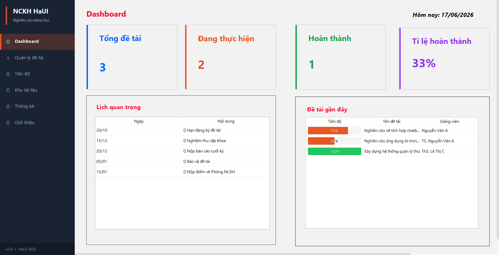
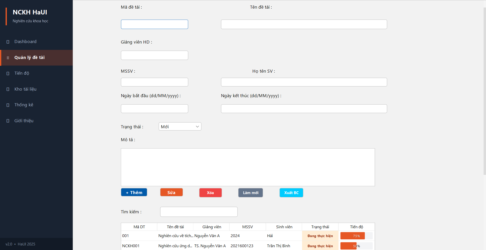
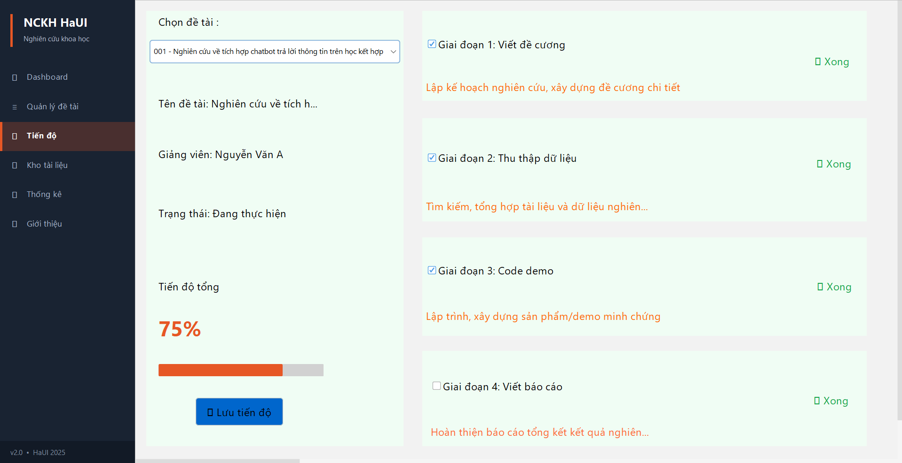
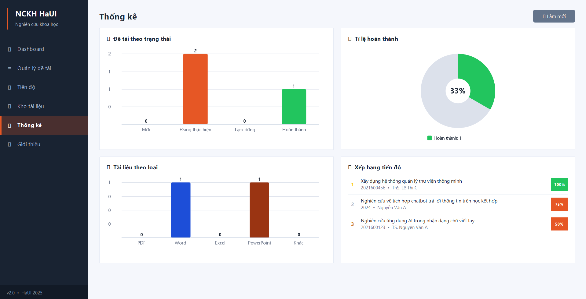

# 🎓 NCKH HaUI — Hệ thống Hỗ trợ Nghiên cứu Khoa học

<div align="center">


**Ứng dụng desktop quản lý đề tài nghiên cứu khoa học cho sinh viên & giảng viên Đại học Công nghiệp Hà Nội**

</div>

---

## 📸 Giao diện

| Dashboard                       | Quản lý đề tài            |
| ------------------------------- | ------------------------- |
|  |  |

| Tiến độ                   | Thống kê                    |
| ------------------------- | --------------------------- |
|  |  |

## ✨ Tính năng

### 📊 Dashboard

- Hiển thị tổng quan: tổng đề tài, đang thực hiện, hoàn thành, tỉ lệ %
- Lịch các mốc quan trọng trong năm học
- Danh sách đề tài gần đây kèm tiến độ

### 📚 Quản lý đề tài

- Thêm, sửa, xóa đề tài NCKH
- Tìm kiếm realtime theo mã, tên, giảng viên
- Xuất báo cáo đề tài dạng văn bản (.txt)
- Hiển thị trạng thái và tiến độ bằng màu sắc trực quan

### 📈 Theo dõi tiến độ

- Theo dõi 4 giai đoạn: Viết đề cương → Thu thập dữ liệu → Code demo → Viết báo cáo
- Cập nhật % tiến độ tự động theo checkbox
- Lưu trạng thái tiến độ cho từng đề tài

### 📁 Kho tài liệu

- Thêm file tài liệu (PDF, Word, Excel, PowerPoint)
- Liên kết tài liệu với đề tài cụ thể
- Mở file trực tiếp từ ứng dụng
- Tìm kiếm tài liệu realtime

### 📉 Thống kê

- Biểu đồ cột: số đề tài theo trạng thái
- Biểu đồ tròn (donut): tỉ lệ hoàn thành
- Biểu đồ tài liệu theo loại
- Bảng xếp hạng top 5 đề tài theo tiến độ

### ℹ️ Giới thiệu

- Thông tin ứng dụng và công nghệ sử dụng
- Danh sách tính năng tổng quan

---

## 🛠️ Công nghệ sử dụng

| Công nghệ  | Phiên bản    | Mục đích                     |
| ---------- | ------------ | ---------------------------- |
| Java       | 17           | Ngôn ngữ lập trình chính     |
| Java Swing | JDK built-in | Giao diện người dùng desktop |
| FlatLaf    | 3.5.4        | Theme giao diện hiện đại     |
| Gson       | 2.13.1       | Lưu trữ dữ liệu JSON         |
| Maven      | 3.x          | Quản lý dependencies & build |

---

## 📁 Cấu trúc project

```
NCKH_HaUI-Application/
├── src/main/java/com/haui/
│   ├── main/
│   │   └── Main.java               # Điểm khởi chạy
│   ├── model/
│   │   ├── DeTai.java              # Model đề tài
│   │   ├── TaiLieu.java            # Model tài liệu
│   │   └── Deadline.java           # Model deadline
│   ├── service/
│   │   ├── DataService.java        # Xử lý nghiệp vụ chính
│   │   ├── JsonService.java        # Đọc/ghi dữ liệu JSON
│   │   └── ReportService.java      # Xuất báo cáo
│   ├── ui/
│   │   ├── MainFrame.java          # Cửa sổ chính + sidebar
│   │   ├── DashboardForm.java      # Tab Dashboard
│   │   ├── DeTaiForm.java          # Tab Quản lý đề tài
│   │   ├── ProgressForm.java       # Tab Tiến độ
│   │   ├── TaiLieuForm.java        # Tab Kho tài liệu
│   │   ├── ThongKePanel.java       # Tab Thống kê
│   │   ├── AboutPanel.java         # Tab Giới thiệu
│   │   ├── TableRenderers.java     # Custom renderer
│   │   └── AppContext.java         # Context toàn cục
│   └── util/
│       └── StyleManager.java       # Màu sắc & font dùng chung
├── data.json                       # Dữ liệu đề tài
├── tailieu.json                    # Dữ liệu tài liệu
├── pom.xml
└── README.md
```

---

## 🚀 Cài đặt & Chạy

### Yêu cầu

- **Java 17+** đã được cài đặt
- **Maven 3.x** (nếu build từ source)

### Cách 1: Chạy file JAR trực tiếp

```bash
java -jar target/nckh-haui-2.0-executable.jar
```

### Cách 2: Build từ source

```bash
# Clone repository
git clone https://github.com/<your-username>/NCKH_HaUI-Application.git
cd NCKH_HaUI-Application

# Build
mvn clean package

# Chạy
java -jar target/nckh-haui-2.0-executable.jar
```

---

## 💾 Dữ liệu

Dữ liệu được lưu tự động dưới dạng JSON trong thư mục chạy ứng dụng:

- `data.json` — Danh sách đề tài NCKH
- `tailieu.json` — Danh sách tài liệu trong kho

---

## 👨‍💻 Tác giả

**Lê Minh Tuyên**  
 Đại học Công nghiệp Hà Nội (HaUI)  
📅 2026

---

## 📄 License

Dự án được phát triển dành cho mục đích học tập đối với học phần Lập trình Java tại HaUI.

---

<div align="center">
TuyenMinh-dev
</div>
